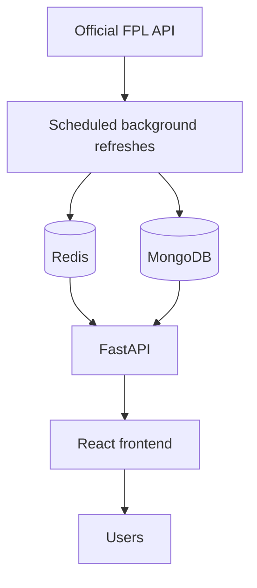
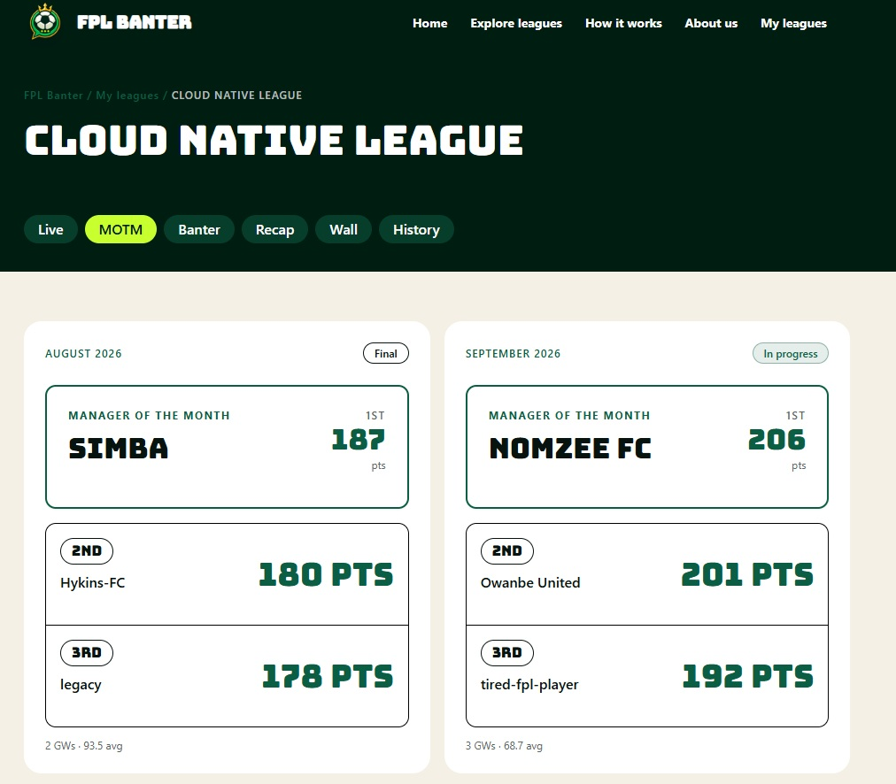

# FPL Banter — Engineering Showcase

> Production FPL community platform. Public engineering showcase; production source code is private.

**FPL Banter** is a live Fantasy Premier League platform designed to make private mini-leagues more social, competitive, and entertaining through live standings, custom banter statistics, monthly awards, and shareable league moments.

🌐 **Live product:** https://fplbanter.com

The production repository is intentionally private. This public repository documents the architecture, engineering decisions, product thinking, reliability work, and operational lessons behind the platform without publishing the implementation.

## What I built

- React frontend for league dashboards, standings, banter statistics, monthly winners, authentication, and team-linking flows
- FastAPI backend for application APIs and FPL data workflows
- MongoDB persistence for leagues, managers, gameweeks, and derived statistics
- Redis + Celery for background work, caching, and scheduled processing
- Live FPL refresh architecture designed to avoid page-triggered calls to the upstream FPL API
- Private league onboarding, commissioner flows, team ownership verification, and invite-based access
- Gameweek finalisation with completeness checks before finished data becomes authoritative
- Automated tests covering scoring, standings, live reads, finalisation, and banter calculations
- Separate local, staging, and production environments

## The problem

Official FPL gives managers scores and rankings, but private leagues are often missing the social layer that makes competition memorable.

FPL Banter turns league data into stories:

- **Gameweek Rocket**
- **Tournament Leader**
- **Transfer Tornado**
- **Captain Catastrophe**
- **Wooden Spoon Warrior**
- **Comeback King**
- **Freefall Legend**
- **Differential Genius**
- **Benched Beast**
- **Overall Rank King**

The engineering challenge is making those features feel live while keeping upstream API traffic controlled and ensuring incomplete data never becomes the final source of truth.

## High-level architecture

A core design rule is that **browser page views should not trigger new requests to the official FPL API**. Shared background processes fetch upstream data, persist the result, and the web application reads local state.

## Technology

| Area | Technology |
| --- | --- |
| Frontend | React, Tailwind CSS |
| Backend | FastAPI, Python |
| Database | MongoDB |
| Cache / broker | Redis |
| Background jobs | Celery |
| External data | Official Fantasy Premier League API |
| Deployment | Linux VPS with separate staging and production environments |
| Testing | Pytest + frontend tests |

## Engineering write-ups

- [System architecture](docs/architecture.md)
- [Live scoring and refresh model](docs/live-scoring.md)
- [Reliability and gameweek finalisation](docs/reliability.md)
- [Engineering decisions and lessons](docs/engineering-decisions.md)

## Selected engineering problems solved

### Preventing partial final results

An early version could mark a gameweek aggregate as finished even when only a subset of the official league roster had been processed.

The fix was not just a UI patch. The final refresh path was changed to build from the official league roster, process the expected managers, validate completeness, and only then allow the finished aggregate to become authoritative.

### Keeping live reads cheap

The live experience uses shared polling and persisted snapshots rather than letting every visitor independently hit the FPL API.

That means 100 users refreshing a league page should still read the same locally stored application state rather than create 100 upstream requests.

### Separating provisional and final truth

Live scoring is intentionally provisional. Some FPL behaviour, including final autosubs and captain changes, is best reconciled once official gameweek data settles.

The application therefore treats live calculation and finished-gameweek reconciliation as different stages instead of pretending provisional data is final.

## Repository policy

This repository contains **documentation only**.

It intentionally excludes:

- production source code
- environment files
- credentials and secrets
- deployment configuration containing sensitive values
- proprietary scoring implementation
- internal operational data

For hiring conversations, I can walk through selected technical decisions, debugging examples, architecture trade-offs, and implementation patterns in more depth.

## Screenshots

### League Dashboard

### Live Standings

### Banter Page

### MOTM

These screenshots show selected parts of the live product while keeping the private production codebase and sensitive operational details out of the public repository.

---

**Project:** FPL Banter  
**Status:** Live and actively developed  
**Focus:** Full-stack product engineering, live-data systems, reliability, background processing, and production operations
