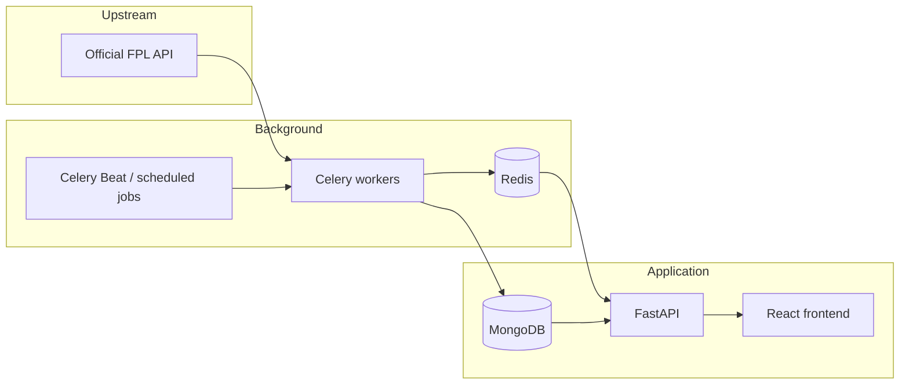

# System Architecture

## Overview

FPL Banter is built around a simple principle:

> Fetch shared FPL data once, process it centrally, and serve application users from local state.

This matters because Fantasy Premier League is an external dependency. A page view should not become an upstream API request.

## Main components

## Backend

The FastAPI application owns the public application API. It handles:

- authentication
- team-linking and verification flows
- league creation and joining
- standings reads
- banter-stat reads
- monthly-winner reads
- administrative actions
- access control for private leagues

The request path is deliberately separated from the heavy FPL refresh path.

## Background processing

Celery is used for work that should not happen inside a normal browser request.

Typical background responsibilities include:

- refreshing league data
- preparing gameweek data
- collecting manager picks
- processing live event data
- calculating derived league statistics
- reconciling completed gameweeks

Redis acts as the task broker and is also useful for short-lived/shared state where appropriate.

## Persistence

MongoDB stores application state such as:

- FPL Banter leagues
- linked manager identities
- league membership metadata
- gameweek aggregates
- standings data
- derived banter statistics
- monthly winners
- finalised snapshots

Finished data is season-scoped and gameweek-scoped so one season cannot silently contaminate another.

## Frontend

The React application consumes the FPL Banter API, not the official FPL API directly.

That gives the product one controlled data path and keeps upstream behaviour out of the browser.

## Environment model

The application is operated across three environments:

- **Local** — development and automated testing
- **Staging** — production-like verification before release
- **Production** — live user traffic

Changes are validated locally, then on staging, before being released to production.

This has been especially useful for data-flow changes where a successful build is not enough; the final validation must include real league behaviour.
