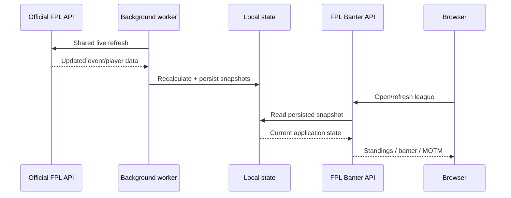

# Live Scoring and Refresh Model

## Goal

The product should feel live during an active gameweek without making every page refresh hit the official FPL API.

The solution is a shared refresh model.

## Live flow

## Key design choice

A real-world football event does not directly trigger FPL Banter.

For example, if a player scores:

1. FPL updates its own data.
2. The next scheduled FPL Banter refresh sees the updated data.
3. The application recalculates the affected live state.
4. The new snapshot is persisted.
5. Browser reads then see the new result.

This trades unnecessary event complexity for a predictable, controlled refresh cadence.

## Shared polling

The application fetches shared event-level FPL data on a schedule while fixtures are live.

Manager picks are also prepared centrally so multiple league pages do not independently request the same information.

## Live standings

The live layer combines:

- stored manager/league context
- cached picks
- current event data
- local scoring logic
- current season/gameweek context

The result is persisted and reused by browser requests.

## Provisional vs final

The live scorer is intentionally provisional.

Some FPL outcomes are not safe to treat as final until official processing settles, especially around:

- autosubs
- vice-captain substitution
- late bonus-point changes
- post-match corrections

The system therefore separates:

**Live state**  
Fast, useful, provisional.

**Final state**  
Reconciled against finished official data and protected by completeness checks.

That distinction is important: a live product does not need to pretend uncertainty does not exist.
