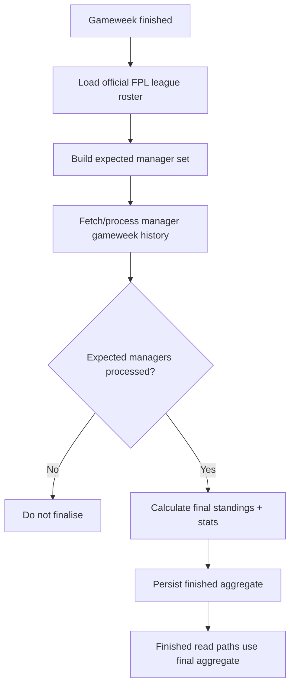

# Reliability and Gameweek Finalisation

## Why finalisation matters

A live system can be approximately current during a match. A finished gameweek cannot be approximately correct.

Once a gameweek is marked final, standings, banter statistics, and monthly outcomes may all depend on it.

That means finalisation needs stronger guarantees than live refreshes.

## Failure discovered

During production testing, a completed aggregate could become authoritative even though only a subset of the official FPL league roster had been processed.

The visible symptom was misleading final league data.

The deeper problem was architectural: the finalisation path trusted incomplete application membership data instead of validating against the full official league roster.

## Corrected finalisation flow

## Completeness guard

The finished aggregate is not promoted simply because a worker completed a loop.

The application compares the processed result against the expected official roster. If the refresh is incomplete, the finished state is blocked.

This prevents a partial dataset from becoming the authoritative source used by the UI.

## Official history as final truth

For a finished gameweek, official manager history is preferred for values such as:

- gameweek score
- total points
- transfer count
- transfer cost

This reduces the chance that provisional calculations leak into final league results.

## Failure isolation

External APIs are not perfectly reliable.

A robust league refresh should distinguish between:

- a temporary failure for one manager
- a partial league refresh
- a genuinely complete final result

A single failed manager should be observable and retriable rather than silently poisoning the whole league or being ignored while the aggregate is still marked complete.

## Read-path correctness

Final data is only useful if the frontend actually reads it.

One production issue occurred because a finished live snapshot correctly disappeared, but the standings read path then fell back to an older cache instead of the new final aggregate.

The correction was to make the finished aggregate explicitly authoritative before legacy/cache fallback paths.

The lesson: correctness depends on both the write path **and** the read path.
